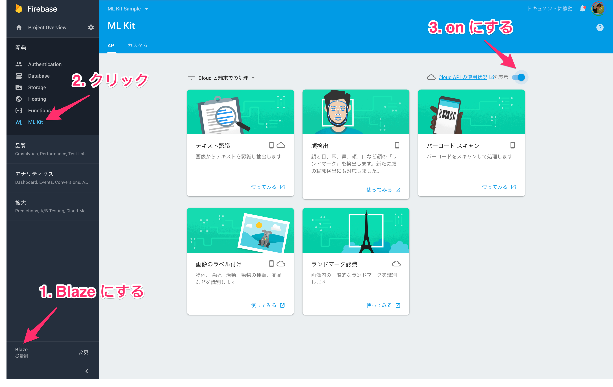

# MLKitSample

https://gdg-tokyo.connpass.com/event/95203/ の課題です。


## 資料

https://speakerdeck.com/yanzm/first-step-of-ml-kit


## ステップ1

1. このプロジェクトを clone する
2. Android Studio を起動する
3. Import project で clone したディレクトリを指定して開く
4. gradle の sync が終わるまで待つ
5. （やりたい人は applicationId やパッケージ名を変える）


## 課題1

firebase console https://console.firebase.google.com/ で新しいプロジェクトを作る。

* プロジェクト名 : 好きな名前（例 ML Kit Sample）
* 国 / 地域 : 日本


## 課題2

1. 作った firebase プロジェクトに Android アプリを追加する（「Android アプリ に Firebase を追加」を選択する）
2. google-services.json をダウンロードし、Android プロジェクトの指定の場所に置く
3. アプリを実行する

dependency に
```
implementation 'com.google.firebase:firebase-ml-vision:16.0.0'
```
を追加する。


## 課題3 : テキスト認識

https://firebase.google.com/docs/ml-kit/android/recognize-text#on-device

「TODO: 1 on-device テキスト認識」を実装する。

```kotlin
detectButton.isEnabled = false
progressBar.visibility = View.VISIBLE

val image = FirebaseVisionImage.fromBitmap(bitmap)

FirebaseVision.getInstance()
        .visionTextDetector
        .detectInImage(image)
        .addOnSuccessListener { texts ->
            detectButton.isEnabled = true
            progressBar.visibility = View.GONE

            for (block in texts.blocks) {
                for (line in block.lines) {
                    for (element in line.elements) {
                        element.boundingBox?.let {
                            overlay.add(BoxData(element.text, it))
                        }
                    }
                }
            }
        }
        .addOnFailureListener { e ->
            detectButton.isEnabled = true
            progressBar.visibility = View.GONE
            e.printStackTrace()
        }
```

## 課題4 : 顔検出

https://firebase.google.com/docs/ml-kit/android/detect-faces#on-device

「TODO: 2 on-device 顔検出」を実装する。

```kotlin
detectButton.isEnabled = false
progressBar.visibility = View.VISIBLE

val image = FirebaseVisionImage.fromBitmap(bitmap)

FirebaseVision.getInstance()
        .visionFaceDetector
        .detectInImage(image)
        .addOnSuccessListener { faces ->
            detectButton.isEnabled = true
            progressBar.visibility = View.GONE

            for (face in faces) {
                face.boundingBox?.let {
                    overlay.add(BoxData("", it))
                }
            }
        }
        .addOnFailureListener { e ->
            detectButton.isEnabled = true
            progressBar.visibility = View.GONE
            e.printStackTrace()
        }
```

## 課題5 : 顔検出

option を指定する。

* ModeType では速度優先か正確性優先かを指定できる。
* LandmarkType では eyes, ears, nose, cheeks, mouth の位置を判定するか指定できる。
* ClassificationType では笑顔かどうか、目が空いているかどうかを判定するか指定できる。
* MinFaceSize は検出する最小の顔の大きさを画像に対する比率で指定する。
* TrackingEnabled は顔に id を割り振るかどうかを指定できる。

```kotlin
val options = FirebaseVisionFaceDetectorOptions.Builder()
        .setModeType(FirebaseVisionFaceDetectorOptions.ACCURATE_MODE)
        .setLandmarkType(FirebaseVisionFaceDetectorOptions.ALL_LANDMARKS)
        .setClassificationType(FirebaseVisionFaceDetectorOptions.ALL_CLASSIFICATIONS)
        .setMinFaceSize(0.15f)
        .setTrackingEnabled(true)
        .build()

FirebaseVision.getInstance()
        .getVisionFaceDetector(options)
        .detectInImage(image)
        .addOnSuccessListener { faces ->
            detectButton.isEnabled = true
            progressBar.visibility = View.GONE

            for (face in faces) {
                face.boundingBox?.let {
                    overlay.add(BoxData(face.smilingProbability.toString(), it))
                }
            }
        }
        ...
```

## 課題6 : バーコードスキャン

https://firebase.google.com/docs/ml-kit/android/read-barcodes#configure-the-barcode-detector

「TODO: 3 on-device バーコードスキャン」を実装する。

```kotlin
detectButton.isEnabled = false
progressBar.visibility = View.VISIBLE

val image = FirebaseVisionImage.fromBitmap(bitmap)

FirebaseVision.getInstance()
        .visionBarcodeDetector
        .detectInImage(image)
        .addOnSuccessListener { barcodes ->
            detectButton.isEnabled = true
            progressBar.visibility = View.GONE

            for (barcode in barcodes) {
                barcode.boundingBox?.let {
                    overlay.add(BoxData(barcode.rawValue ?: "", it))
                }
            }
        }
        .addOnFailureListener { e ->
            detectButton.isEnabled = true
            progressBar.visibility = View.GONE
            e.printStackTrace()
        }
```

おまけ : option を指定する。option では検出するバーコードの種類を制限できる。

```kotlin

val options = FirebaseVisionBarcodeDetectorOptions.Builder()
        .setBarcodeFormats(
                FirebaseVisionBarcode.FORMAT_EAN_8,
                FirebaseVisionBarcode.FORMAT_EAN_13)
        .build()

FirebaseVision.getInstance()
        .getVisionBarcodeDetector(options)
        .detectInImage(image)
        ...
```


## 課題7 : 画像のラベル付け

https://firebase.google.com/docs/ml-kit/android/label-images#on-device

「TODO: 4 on-device ラベルづけ」を実装する。

dependency に
```
implementation 'com.google.firebase:firebase-ml-vision-image-label-model:15.0.0'
```
を追加する。

```kotlin
detectButton.isEnabled = false
progressBar.visibility = View.VISIBLE

val image = FirebaseVisionImage.fromBitmap(bitmap)

FirebaseVision.getInstance()
        .visionLabelDetector
        .detectInImage(image)
        .addOnSuccessListener { labels ->
            detectButton.isEnabled = true
            progressBar.visibility = View.GONE

            overlay.add(TextsData(labels.map { "${it.label}, ${it.confidence}" }))
        }
        .addOnFailureListener { e ->
            detectButton.isEnabled = true
            progressBar.visibility = View.GONE
            e.printStackTrace()
        }
```

おまけ : option を指定する。

デフォルトでは確率の高い方から 10 個出力されるが、ConfidenceThreshold を指定すると、
それ以上の確率のものだけが出力される。


```kotlin
val options = FirebaseVisionLabelDetectorOptions.Builder()
        .setConfidenceThreshold(0.8f)
        .build()

FirebaseVision.getInstance()
        .getVisionLabelDetector(options)
        .detectInImage(image)
```


## 課題8 : Cloud API

Cloud API を利用するには Plan を Blaze に変更する必要がある。
課金設定を行える人だけやってみる。

https://console.firebase.google.com/ の左メニューの一番下の項目で Plan を Blaze に変える。

左メニューの [開発] - [ML Kit] をクリックし、右側の [Cloud API の使用状況] をクリックし、
Cloud Vision API を有効にする。





## 課題9 : テキスト認識 Cloud API

https://firebase.google.com/docs/ml-kit/android/recognize-text#cloud-based

「TODO: 5 cloud テキスト認識」を実装する。

```kotlin
detectButton.isEnabled = false
progressBar.visibility = View.VISIBLE

val image = FirebaseVisionImage.fromBitmap(bitmap)

FirebaseVision.getInstance()
        .visionCloudTextDetector
        .detectInImage(image)
        .addOnSuccessListener { cloudText ->
            detectButton.isEnabled = true
            progressBar.visibility = View.GONE

            for (page in cloudText.pages) {
                for (block in page.blocks) {
                    for (paragraph in block.paragraphs) {
                        for (word in paragraph.words) {
                            val text = word.symbols.joinToString(separator = "") { it.text }
                            word.boundingBox?.let {
                                overlay.add(BoxData(text, it))
                            }
                        }
                    }
                }
            }
        }
        .addOnFailureListener { e ->
            detectButton.isEnabled = true
            progressBar.visibility = View.GONE
            e.printStackTrace()
        }
```

おまけ : option を指定する。

```kotlin
val options = FirebaseVisionCloudDetectorOptions.Builder()
        .setModelType(FirebaseVisionCloudDetectorOptions.LATEST_MODEL)
        .setMaxResults(15)
        .build()

FirebaseVision.getInstance()
        .getVisionCloudTextDetector(options)
        .detectInImage(image)
        ...
```


## 課題10 : 画像のラベル付け Cloud API

https://firebase.google.com/docs/ml-kit/android/label-images#cloud-based

「TODO: 6 cloud ラベルづけ」を実装する。

```kotlin
detectButton.isEnabled = false
progressBar.visibility = View.VISIBLE

val image = FirebaseVisionImage.fromBitmap(bitmap)

FirebaseVision.getInstance()
        .visionCloudLabelDetector
        .detectInImage(image)
        .addOnSuccessListener { labels ->
            detectButton.isEnabled = true
            progressBar.visibility = View.GONE

            overlay.add(TextsData(labels.map { "${it.label}, ${it.confidence}" }))
        }
        .addOnFailureListener { e ->
            detectButton.isEnabled = true
            progressBar.visibility = View.GONE
            e.printStackTrace()
        }
```

おまけ : option を指定する。

```kotlin
val options = FirebaseVisionCloudDetectorOptions.Builder()
        .setModelType(FirebaseVisionCloudDetectorOptions.LATEST_MODEL)
        .setMaxResults(15)
        .build()

FirebaseVision.getInstance()
        .getVisionCloudLabelDetector(options)
        .detectInImage(image)
```


## 課題11 : ランドマーク認識 Cloud API

https://firebase.google.com/docs/ml-kit/android/recognize-landmarks#configure-the-landmark-detector

「TODO: 6 cloud TODO: 7 cloud ランドマーク認識」を実装する。

```kotlin
detectButton.isEnabled = false
progressBar.visibility = View.VISIBLE

val image = FirebaseVisionImage.fromBitmap(bitmap)

FirebaseVision.getInstance()
        .visionCloudLandmarkDetector
        .detectInImage(image)
        .addOnSuccessListener { labels ->
            detectButton.isEnabled = true
            progressBar.visibility = View.GONE

            overlay.add(TextsData(labels.map { "${it.landmark}, ${it.confidence}" }))
        }
        .addOnFailureListener { e ->
            detectButton.isEnabled = true
            progressBar.visibility = View.GONE
            e.printStackTrace()
        }
```

おまけ : option を指定する。

```kotlin
val options = FirebaseVisionCloudDetectorOptions.Builder()
        .setModelType(FirebaseVisionCloudDetectorOptions.LATEST_MODEL)
        .setMaxResults(15)
        .build()

FirebaseVision.getInstance()
        .getVisionCloudLandmarkDetector(options)
        .detectInImage(image)
        .addOnSuccessListener { landmarks ->
```

（かなり有名なランドマークじゃないと認識してくれない。Wikipedia のエッフェル塔写真は認識するが、Wikipedia の東京タワーの写真は認識しない）


## 課題12

以下の meta-data を AndroidManifest に宣言すると、インストール時に on-device の ML model が自動でダウンロードされる。
この設定を行わない場合、on-device API を最初に実行したときに model がダウンロードされる。
ダウンロードが完了する前の API リクエストは無視される。

```
<application ...>

    <meta-data
        android:name="com.google.firebase.ml.vision.DEPENDENCIES"
        android:value="ocr,face,barcode,label" />

</application>
```

* ocr : テキスト認識
* face : 顔検出
* barcode : バーコードスキャン
* label : ラベルづけ
